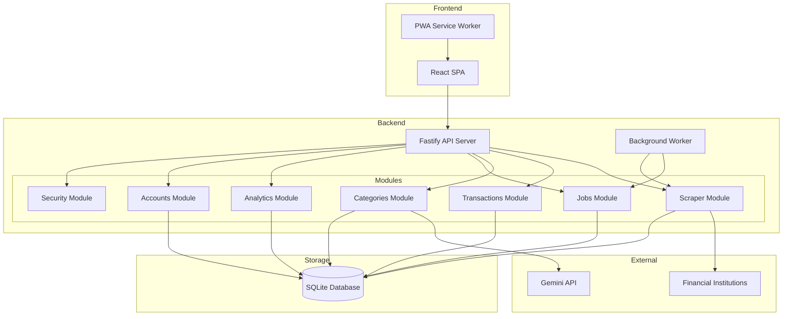
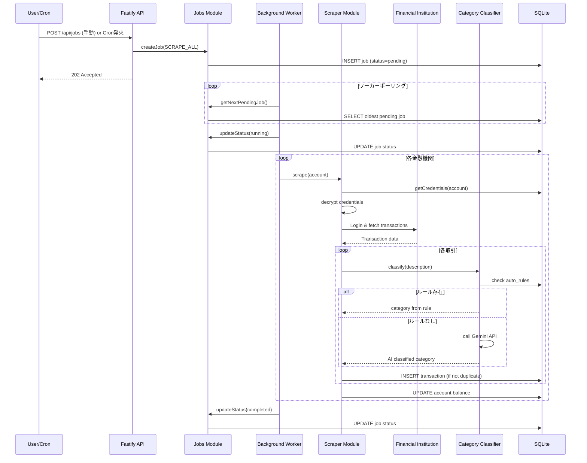
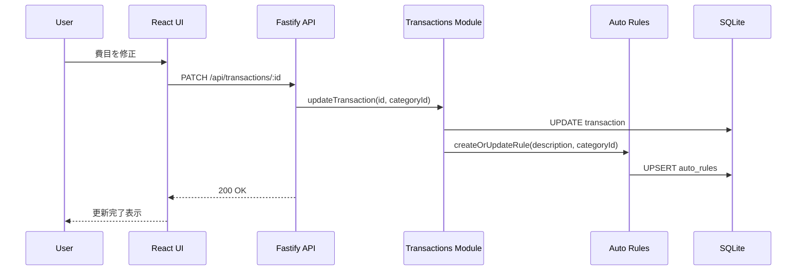
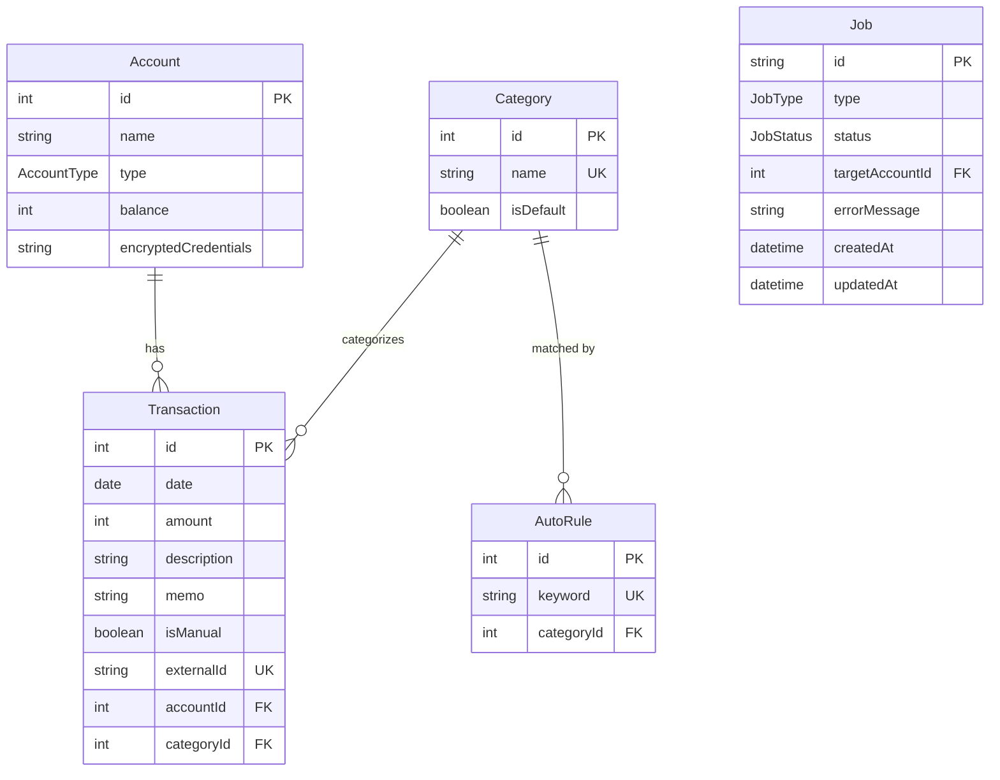

# Design Document

## Overview

**Purpose**: 本アプリケーションは、無料（低コスト）を最優先とし、Webスクレイピングによる金融機関自動連携とAIを活用した費目自動分類を備えた個人向け家計簿Webアプリケーションを提供する。

**Users**: 開発者本人が、日々の収支管理、月次集計・分析、資産残高確認のワークフローで利用する。

**Impact**: 市販アプリの機能制限を解消し、完全に自分の利用に最適化された家計管理環境を実現する。

### Goals
- 6つの金融機関（楽天銀行、三井住友銀行、三菱UFJ銀行、SBI新生銀行、楽天証券、ポケットカード）からの取引データ自動取得
- AI（Gemini API）による費目自動分類と学習機能
- 月次集計・グラフ表示による収支の可視化
- PWA対応によるモバイルフレンドリーな操作性
- 認証情報の安全な暗号化保存

### Non-Goals
- 複数ユーザー対応（個人利用のみ）
- リアルタイム通知機能
- 家計簿データのクラウド同期
- 金融機関APIの正式連携（スクレイピングのみ）

## Architecture

### Architecture Pattern & Boundary Map

**Selected Pattern**: モジュラーモノリス

機能別モジュール（scraper, transactions, categories, jobs, analytics, accounts, security）で論理的に分離しつつ、単一のFastifyサーバーとしてデプロイする。個人開発の規模に最適で、運用コストを最小化しつつ将来の拡張性を確保する。



**Architecture Integration**:
- **Domain Boundaries**: 各モジュールは独自の責務を持ち、モジュール間はサービスインターフェースを通じて連携
- **Existing Patterns**: N/A（新規プロジェクト）
- **New Components Rationale**:
  - Scraper Module: 金融機関ごとのスクレイパー実装を集約
  - Jobs Module: 非同期ジョブのキューイングと実行管理
  - Security Module: 認証情報の暗号化・復号を一元管理
- **Steering Compliance**: 低コスト優先（外部サービス依存を最小化）

### Technology Stack

| Layer | Choice / Version | Role in Feature | Notes |
|-------|------------------|-----------------|-------|
| Frontend | React 18 + Vite 5 | SPA UI構築 | vite-plugin-pwaでPWA化 |
| UI Framework | Tailwind CSS 3 | スタイリング | ユーティリティファースト |
| Data Fetching | TanStack Query v5 | キャッシュ・ポーリング | ジョブステータス監視 |
| Charts | Recharts / Chart.js | グラフ表示 | 月次集計の可視化 |
| Backend | Fastify 4 + TypeScript | APIサーバー | 30,000 req/s対応 |
| Validation | Zod | スキーマバリデーション | 型安全なリクエスト検証 |
| Scraping | Playwright | ブラウザ自動操作 | Chromiumヘッドレス |
| Database | SQLite | データストレージ | 単一ファイルDB |
| ORM | Prisma 5 | DB操作 | better-sqlite3アダプター |
| AI | Google Gemini API | 費目分類 | 2.5 Flash-Lite無料枠 |
| Encryption | Node.js crypto | 認証情報暗号化 | AES-256-GCM |
| Scheduler | node-cron | 定期実行 | 1日1回のスクレイピング |

## System Flows

### スクレイピングジョブ実行フロー



### 費目学習フロー



## Requirements Traceability

| Requirement | Summary | Components | Interfaces | Flows |
|-------------|---------|------------|------------|-------|
| 1.1, 1.2 | スクレイピング実行・取引登録 | ScraperModule, TransactionsModule | ScraperService, TransactionRepository | スクレイピングジョブ実行フロー |
| 1.3 | 重複データ防止 | TransactionsModule | TransactionRepository | スクレイピングジョブ実行フロー |
| 1.4, 1.5 | スクレイピングエラー処理 | ScraperModule, JobsModule | ScraperService, JobService | スクレイピングジョブ実行フロー |
| 1.6 | 6金融機関対応 | ScraperModule | ScraperService | - |
| 2.1-2.6 | 非同期ジョブ管理 | JobsModule, BackgroundWorker | JobService | スクレイピングジョブ実行フロー |
| 3.1-3.3 | 手動入力 | TransactionsModule | TransactionService, API | - |
| 4.1-4.3 | 取引修正・削除・学習 | TransactionsModule, AutoRulesModule | TransactionService, API | 費目学習フロー |
| 5.1-5.5 | 費目管理 | CategoriesModule | CategoryService, API | - |
| 6.1-6.5 | AI費目分類 | ClassifierModule, AutoRulesModule | ClassifierService | スクレイピングジョブ実行フロー, 費目学習フロー |
| 7.1-7.3 | 月次集計・グラフ | AnalyticsModule | AnalyticsService, API | - |
| 8.1-8.3 | 残高確認 | AccountsModule | AccountService, API | - |
| 9.1-9.4 | 口座管理 | AccountsModule, SecurityModule | AccountService, EncryptionService, API | - |
| 10.1-10.3 | セキュリティ | SecurityModule | EncryptionService | - |
| 11.1-11.3 | PWA対応 | Frontend (React + vite-plugin-pwa) | - | - |

## Components and Interfaces

| Component | Domain/Layer | Intent | Req Coverage | Key Dependencies | Contracts |
|-----------|--------------|--------|--------------|------------------|-----------|
| ScraperModule | Backend/Scraper | 金融機関からの取引データ取得 | 1.1-1.6 | Playwright (P0), SecurityModule (P0) | Service, Batch |
| TransactionsModule | Backend/Core | 取引データCRUD | 3.1-3.3, 4.1-4.2 | Prisma (P0) | Service, API |
| CategoriesModule | Backend/Core | 費目管理 | 5.1-5.5 | Prisma (P0) | Service, API |
| ClassifierModule | Backend/AI | 費目自動分類 | 6.1-6.4 | Gemini API (P1), AutoRulesModule (P0) | Service |
| AutoRulesModule | Backend/Core | 分類ルール管理 | 4.3, 6.1, 6.5 | Prisma (P0) | Service |
| JobsModule | Backend/Core | 非同期ジョブ管理 | 2.1-2.6 | Prisma (P0), node-cron (P1) | Service, Batch |
| AnalyticsModule | Backend/Analytics | 集計・分析 | 7.1-7.3 | Prisma (P0) | Service, API |
| AccountsModule | Backend/Core | 口座・残高管理 | 8.1-8.3, 9.1-9.3 | Prisma (P0), SecurityModule (P0) | Service, API |
| SecurityModule | Backend/Security | 認証情報暗号化 | 9.4, 10.1-10.3 | Node.js crypto (P0) | Service |
| BackgroundWorker | Backend/Worker | ジョブ実行ワーカー | 2.3-2.5 | JobsModule (P0), ScraperModule (P0) | Batch |
| ReactApp | Frontend/UI | SPA UI | 3-9, 11 | TanStack Query (P0), Tailwind (P1) | State |

### Backend/Scraper

#### ScraperModule

| Field | Detail |
|-------|--------|
| Intent | 各金融機関サイトからの取引データスクレイピング |
| Requirements | 1.1, 1.2, 1.3, 1.4, 1.5, 1.6 |

**Responsibilities & Constraints**
- 各金融機関ごとの独立したスクレイパー実装を管理
- 認証情報を復号してログイン処理を実行
- 取引データを正規化してTransactionsModuleに渡す
- 部分的失敗時も他の金融機関処理を継続

**Dependencies**
- Inbound: BackgroundWorker — スクレイピング実行指示 (P0)
- Outbound: TransactionsModule — 取引データ登録 (P0)
- Outbound: SecurityModule — 認証情報復号 (P0)
- Outbound: ClassifierModule — 費目分類 (P0)
- External: Playwright — ブラウザ自動操作 (P0)
- External: Financial Institution Sites — データ取得元 (P0)

**Contracts**: Service [x] / Batch [x]

##### Service Interface
```typescript
interface ScraperService {
  scrapeAccount(accountId: number): Promise<Result<ScrapeResult, ScrapeError>>;
  scrapeAllAccounts(): Promise<Result<ScrapeAllResult, ScrapeError>>;
}

interface ScrapeResult {
  accountId: number;
  transactionsAdded: number;
  transactionsSkipped: number;
  newBalance: number;
}

interface ScrapeAllResult {
  results: ScrapeResult[];
  errors: ScrapeAccountError[];
}

interface ScrapeAccountError {
  accountId: number;
  errorType: 'AUTH_FAILED' | 'SITE_CHANGED' | 'NETWORK_ERROR' | 'TWO_FACTOR_REQUIRED';
  message: string;
}

type ScrapeError =
  | { type: 'NO_ACCOUNTS' }
  | { type: 'ALL_FAILED'; errors: ScrapeAccountError[] };
```
- Preconditions: 有効な口座IDが存在すること
- Postconditions: 取引データがDBに登録され、残高が更新される
- Invariants: 重複取引は登録されない

##### Batch Contract
- Trigger: BackgroundWorkerからの呼び出し
- Input: accountId または全口座指定
- Output: ScrapeResult/ScrapeAllResult
- Idempotency: 重複チェックにより同一取引は再登録されない

**Implementation Notes**
- Integration: 各金融機関用のスクレイパークラス（RakutenBankScraper, SMBCScraper等）を実装
- Validation: スクレイピング結果の日付・金額・摘要の形式検証
- Risks: サイト仕様変更によるスクレイパー破損リスク（モジュール分離で影響範囲を限定）

### Backend/Core

#### TransactionsModule

| Field | Detail |
|-------|--------|
| Intent | 取引データのCRUD操作 |
| Requirements | 3.1, 3.2, 3.3, 4.1, 4.2 |

**Responsibilities & Constraints**
- 取引データの作成・読取・更新・削除
- 手動入力フラグの管理
- 重複チェック（external_idベース）

**Dependencies**
- Inbound: ScraperModule — 自動取得取引の登録 (P0)
- Inbound: Fastify API — CRUD操作 (P0)
- Outbound: AutoRulesModule — 費目修正時のルール更新 (P1)
- External: Prisma — DBアクセス (P0)

**Contracts**: Service [x] / API [x]

##### Service Interface
```typescript
interface TransactionService {
  create(data: CreateTransactionInput): Promise<Result<Transaction, ValidationError>>;
  update(id: number, data: UpdateTransactionInput): Promise<Result<Transaction, TransactionError>>;
  delete(id: number): Promise<Result<void, TransactionError>>;
  findById(id: number): Promise<Result<Transaction, NotFoundError>>;
  findByMonth(year: number, month: number): Promise<Transaction[]>;
  findByAccount(accountId: number): Promise<Transaction[]>;
}

interface CreateTransactionInput {
  date: Date;
  amount: number;
  description: string;
  categoryId: number;
  accountId: number;
  memo?: string;
  isManual: boolean;
  externalId?: string;
}

interface UpdateTransactionInput {
  amount?: number;
  categoryId?: number;
  memo?: string;
}

type TransactionError =
  | { type: 'NOT_FOUND' }
  | { type: 'INVALID_CATEGORY' };
```

##### API Contract
| Method | Endpoint | Request | Response | Errors |
|--------|----------|---------|----------|--------|
| GET | /api/transactions | ?year, month, accountId | Transaction[] | - |
| GET | /api/transactions/:id | - | Transaction | 404 |
| POST | /api/transactions | CreateTransactionInput | Transaction | 400, 422 |
| PATCH | /api/transactions/:id | UpdateTransactionInput | Transaction | 400, 404, 422 |
| DELETE | /api/transactions/:id | - | - | 404 |

#### CategoriesModule

| Field | Detail |
|-------|--------|
| Intent | 費目（カテゴリ）のCRUD操作 |
| Requirements | 5.1, 5.2, 5.3, 5.4, 5.5 |

**Responsibilities & Constraints**
- 費目の作成・読取・更新・削除
- デフォルト費目の初期データ提供
- 使用中費目の削除防止

**Dependencies**
- Inbound: Fastify API — CRUD操作 (P0)
- Outbound: TransactionsModule — 使用状況確認 (P1)
- External: Prisma — DBアクセス (P0)

**Contracts**: Service [x] / API [x]

##### Service Interface
```typescript
interface CategoryService {
  getAll(): Promise<Category[]>;
  create(name: string): Promise<Result<Category, ValidationError>>;
  update(id: number, name: string): Promise<Result<Category, CategoryError>>;
  delete(id: number): Promise<Result<void, CategoryError>>;
  seedDefaults(): Promise<void>;
}

type CategoryError =
  | { type: 'NOT_FOUND' }
  | { type: 'IN_USE'; transactionCount: number }
  | { type: 'DUPLICATE_NAME' };
```

##### API Contract
| Method | Endpoint | Request | Response | Errors |
|--------|----------|---------|----------|--------|
| GET | /api/categories | - | Category[] | - |
| POST | /api/categories | { name: string } | Category | 400, 409 |
| PATCH | /api/categories/:id | { name: string } | Category | 400, 404, 409 |
| DELETE | /api/categories/:id | - | - | 404, 409 |

#### JobsModule

| Field | Detail |
|-------|--------|
| Intent | 非同期ジョブのキューイングと状態管理 |
| Requirements | 2.1, 2.2, 2.3, 2.4, 2.5, 2.6 |

**Responsibilities & Constraints**
- ジョブの作成・状態更新・取得
- pending状態のジョブを古い順に取得
- running状態のジョブ存在チェック（多重実行防止）

**Dependencies**
- Inbound: Fastify API — ジョブ投入 (P0)
- Inbound: node-cron — 定期ジョブ投入 (P1)
- Inbound: BackgroundWorker — ジョブ取得・状態更新 (P0)
- External: Prisma — DBアクセス (P0)

**Contracts**: Service [x] / API [x] / Batch [x]

##### Service Interface
```typescript
interface JobService {
  create(type: JobType, targetAccountId?: number): Promise<Job>;
  getNextPending(): Promise<Job | null>;
  hasRunningJob(): Promise<boolean>;
  updateStatus(id: string, status: JobStatus, errorMessage?: string): Promise<Job>;
  getRecent(limit: number): Promise<Job[]>;
}

type JobType = 'SCRAPE_ALL' | 'SCRAPE_SPECIFIC';
type JobStatus = 'pending' | 'running' | 'completed' | 'failed';

interface Job {
  id: string;
  type: JobType;
  status: JobStatus;
  targetAccountId?: number;
  errorMessage?: string;
  createdAt: Date;
  updatedAt: Date;
}
```

##### API Contract
| Method | Endpoint | Request | Response | Errors |
|--------|----------|---------|----------|--------|
| POST | /api/jobs | { type, targetAccountId? } | Job | 400 |
| GET | /api/jobs | ?limit | Job[] | - |
| GET | /api/jobs/:id | - | Job | 404 |

##### Batch Contract
- Trigger: node-cronで設定時刻（デフォルト深夜3時）に発火
- Input: なし（SCRAPE_ALL固定）
- Output: Job（pending状態で作成）
- Idempotency: ジョブIDはULIDで一意

#### AutoRulesModule

| Field | Detail |
|-------|--------|
| Intent | 費目自動分類ルールの管理 |
| Requirements | 4.3, 6.1, 6.5 |

**Responsibilities & Constraints**
- 摘要キーワードと費目の紐付け管理
- ルールの検索・作成・更新
- ユーザー修正時の学習ルール自動登録

**Dependencies**
- Inbound: ClassifierModule — ルール検索 (P0)
- Inbound: TransactionsModule — ルール更新 (P0)
- External: Prisma — DBアクセス (P0)

**Contracts**: Service [x]

##### Service Interface
```typescript
interface AutoRulesService {
  findByKeyword(keyword: string): Promise<AutoRule | null>;
  createOrUpdate(keyword: string, categoryId: number): Promise<AutoRule>;
  getAll(): Promise<AutoRule[]>;
  delete(id: number): Promise<void>;
}

interface AutoRule {
  id: number;
  keyword: string;
  categoryId: number;
  category: Category;
}
```

#### AccountsModule

| Field | Detail |
|-------|--------|
| Intent | 口座・カードの管理と残高追跡 |
| Requirements | 8.1, 8.2, 8.3, 9.1, 9.2, 9.3 |

**Responsibilities & Constraints**
- 口座情報のCRUD
- 残高の更新・取得
- 認証情報の保存（暗号化はSecurityModuleに委譲）

**Dependencies**
- Inbound: Fastify API — CRUD操作 (P0)
- Inbound: ScraperModule — 残高更新 (P0)
- Outbound: SecurityModule — 認証情報暗号化/復号 (P0)
- External: Prisma — DBアクセス (P0)

**Contracts**: Service [x] / API [x]

##### Service Interface
```typescript
interface AccountService {
  getAll(): Promise<AccountWithBalance[]>;
  getById(id: number): Promise<Result<Account, NotFoundError>>;
  create(data: CreateAccountInput): Promise<Result<Account, ValidationError>>;
  update(id: number, data: UpdateAccountInput): Promise<Result<Account, AccountError>>;
  delete(id: number): Promise<Result<void, AccountError>>;
  updateBalance(id: number, balance: number): Promise<void>;
  getCredentials(id: number): Promise<DecryptedCredentials>;
}

type AccountType = 'BANK' | 'CARD' | 'SECURITIES' | 'CASH';

interface CreateAccountInput {
  name: string;
  type: AccountType;
  credentials?: CredentialsInput;
  initialBalance?: number;
}

interface AccountWithBalance {
  id: number;
  name: string;
  type: AccountType;
  balance: number;
}
```

##### API Contract
| Method | Endpoint | Request | Response | Errors |
|--------|----------|---------|----------|--------|
| GET | /api/accounts | - | AccountWithBalance[] | - |
| GET | /api/accounts/:id | - | Account | 404 |
| POST | /api/accounts | CreateAccountInput | Account | 400, 422 |
| PATCH | /api/accounts/:id | UpdateAccountInput | Account | 400, 404 |
| DELETE | /api/accounts/:id | - | - | 404, 409 |

### Backend/AI

#### ClassifierModule

| Field | Detail |
|-------|--------|
| Intent | 取引の費目自動分類 |
| Requirements | 6.1, 6.2, 6.3, 6.4 |

**Responsibilities & Constraints**
- ルールベース分類を優先実行
- ルール未該当時はGemini APIで推論
- API失敗時は「使途不明金」にフォールバック

**Dependencies**
- Inbound: ScraperModule — 分類リクエスト (P0)
- Outbound: AutoRulesModule — ルール検索 (P0)
- Outbound: CategoriesModule — 費目一覧取得 (P0)
- External: Gemini API — AI推論 (P1)

**Contracts**: Service [x]

##### Service Interface
```typescript
interface ClassifierService {
  classify(description: string): Promise<ClassificationResult>;
  classifyBatch(descriptions: string[]): Promise<ClassificationResult[]>;
}

interface ClassificationResult {
  categoryId: number;
  categoryName: string;
  source: 'RULE' | 'AI' | 'FALLBACK';
  confidence?: number;
}
```

**Implementation Notes**
- Integration: Gemini 2.5 Flash-Lite APIを使用（15 RPM、1,000リクエスト/日）
- Validation: AIレスポンスが有効な費目IDかを検証
- Risks: API枠削減リスク（ルールベース優先で呼び出し最小化）

### Backend/Analytics

#### AnalyticsModule

| Field | Detail |
|-------|--------|
| Intent | 月次集計と分析データ提供 |
| Requirements | 7.1, 7.2, 7.3 |

**Responsibilities & Constraints**
- 月別の収入・支出・純収支の集計
- 費目別内訳の算出
- グラフ表示用データの整形

**Dependencies**
- Inbound: Fastify API — 集計データ取得 (P0)
- External: Prisma — DBアクセス (P0)

**Contracts**: Service [x] / API [x]

##### Service Interface
```typescript
interface AnalyticsService {
  getMonthlySummary(year: number, month: number): Promise<MonthlySummary>;
  getCategoryBreakdown(year: number, month: number): Promise<CategoryBreakdown[]>;
  getMonthlyTrend(months: number): Promise<MonthlyTrend[]>;
}

interface MonthlySummary {
  year: number;
  month: number;
  totalIncome: number;
  totalExpense: number;
  netBalance: number;
}

interface CategoryBreakdown {
  categoryId: number;
  categoryName: string;
  amount: number;
  percentage: number;
}

interface MonthlyTrend {
  year: number;
  month: number;
  income: number;
  expense: number;
}
```

##### API Contract
| Method | Endpoint | Request | Response | Errors |
|--------|----------|---------|----------|--------|
| GET | /api/analytics/monthly | ?year, month | MonthlySummary | 400 |
| GET | /api/analytics/categories | ?year, month | CategoryBreakdown[] | 400 |
| GET | /api/analytics/trend | ?months | MonthlyTrend[] | 400 |

### Backend/Security

#### SecurityModule

| Field | Detail |
|-------|--------|
| Intent | 認証情報の暗号化・復号 |
| Requirements | 9.4, 10.1, 10.2, 10.3 |

**Responsibilities & Constraints**
- AES-256-GCM暗号化の実行
- マスターキーの環境変数管理
- 復号操作のログ記録

**Dependencies**
- Inbound: AccountsModule — 暗号化/復号リクエスト (P0)
- External: Node.js crypto — 暗号化ライブラリ (P0)

**Contracts**: Service [x]

##### Service Interface
```typescript
interface EncryptionService {
  encrypt(plaintext: string): EncryptedData;
  decrypt(encrypted: EncryptedData): string;
}

interface EncryptedData {
  ciphertext: string;  // Base64エンコード
  iv: string;          // Base64エンコード（12バイト）
  authTag: string;     // Base64エンコード（16バイト）
}
```

- Preconditions: MASTER_KEY環境変数が設定されていること
- Postconditions: 暗号化データは復号可能であること
- Invariants: 各暗号化でユニークなIVを使用

**Implementation Notes**
- Integration: Node.js crypto.createCipheriv/createDecipherivを使用
- Validation: 復号時の認証タグ検証で改ざん検出
- Risks: マスターキー漏洩リスク（環境変数で管理、本番環境では秘密管理サービス推奨）

### Backend/Worker

#### BackgroundWorker

| Field | Detail |
|-------|--------|
| Intent | 非同期ジョブの実行 |
| Requirements | 2.3, 2.4, 2.5 |

**Responsibilities & Constraints**
- jobsテーブルをポーリングしてpendingジョブを取得
- 同時実行は1ジョブのみ（多重実行防止）
- ジョブ完了後にステータス更新

**Dependencies**
- Outbound: JobsModule — ジョブ取得・状態更新 (P0)
- Outbound: ScraperModule — スクレイピング実行 (P0)

**Contracts**: Batch [x]

##### Batch Contract
- Trigger: 起動時からのポーリングループ（5秒間隔）
- Input: pendingジョブ
- Output: ジョブ実行結果
- Idempotency: running状態のジョブがあれば次のジョブに着手しない

### Frontend/UI

#### ReactApp

| Field | Detail |
|-------|--------|
| Intent | ユーザーインターフェースの提供 |
| Requirements | 3.1-3.3, 4.1-4.2, 5.2-5.4, 7.1-7.3, 8.1, 8.3, 9.1-9.3, 11.1-11.3 |

**Responsibilities & Constraints**
- 取引一覧・入力・編集UI
- 月次レポート・グラフ表示
- 口座管理・残高表示
- PWAとしてのインストール対応

**Dependencies**
- Outbound: Fastify API — データ取得・更新 (P0)
- External: TanStack Query — データフェッチング (P0)
- External: Tailwind CSS — スタイリング (P1)
- External: Recharts — グラフ描画 (P1)
- External: vite-plugin-pwa — PWA対応 (P1)

**Contracts**: State [x]

##### State Management
```typescript
// TanStack Query keys
const queryKeys = {
  transactions: (year: number, month: number) => ['transactions', year, month],
  categories: () => ['categories'],
  accounts: () => ['accounts'],
  jobs: () => ['jobs'],
  analytics: (year: number, month: number) => ['analytics', year, month],
};

// Job status polling
const useJobStatus = (jobId: string) => {
  return useQuery({
    queryKey: ['job', jobId],
    queryFn: () => fetchJob(jobId),
    refetchInterval: (data) =>
      data?.status === 'running' || data?.status === 'pending' ? 2000 : false,
  });
};
```

## Data Models

### Domain Model



**Aggregates**:
- Account（口座）: 認証情報と残高を管理
- Transaction（取引）: 収支データの基本単位
- Category（費目）: 分類用マスタデータ
- AutoRule（分類ルール）: 自動分類用の学習データ
- Job（ジョブ）: 非同期処理の状態管理

**Business Rules**:
- 取引の金額は支出がマイナス、収入がプラス
- externalIdによる重複取引の防止
- 使用中の費目は削除不可

### Physical Data Model

**Prisma Schema**:
```prisma
model Account {
  id                  Int           @id @default(autoincrement())
  name                String
  type                String        // BANK, CARD, SECURITIES, CASH
  balance             Int           @default(0)
  encryptedCredentials String?
  credentialsIv       String?
  credentialsAuthTag  String?
  transactions        Transaction[]
  createdAt           DateTime      @default(now())
  updatedAt           DateTime      @updatedAt
}

model Transaction {
  id          Int      @id @default(autoincrement())
  date        DateTime
  amount      Int
  description String
  memo        String?
  isManual    Boolean  @default(false)
  externalId  String?  @unique
  accountId   Int
  categoryId  Int
  account     Account  @relation(fields: [accountId], references: [id])
  category    Category @relation(fields: [categoryId], references: [id])
  createdAt   DateTime @default(now())
  updatedAt   DateTime @updatedAt

  @@index([date])
  @@index([accountId])
  @@index([categoryId])
}

model Category {
  id           Int           @id @default(autoincrement())
  name         String        @unique
  isDefault    Boolean       @default(false)
  transactions Transaction[]
  autoRules    AutoRule[]
  createdAt    DateTime      @default(now())
  updatedAt    DateTime      @updatedAt
}

model AutoRule {
  id         Int      @id @default(autoincrement())
  keyword    String   @unique
  categoryId Int
  category   Category @relation(fields: [categoryId], references: [id])
  createdAt  DateTime @default(now())
  updatedAt  DateTime @updatedAt
}

model Job {
  id              String   @id @default(cuid())
  type            String   // SCRAPE_ALL, SCRAPE_SPECIFIC
  status          String   @default("pending") // pending, running, completed, failed
  targetAccountId Int?
  errorMessage    String?
  createdAt       DateTime @default(now())
  updatedAt       DateTime @updatedAt

  @@index([status, createdAt])
}
```

**Indexes**:
- Transaction: date, accountId, categoryId（月次集計・口座別取得の高速化）
- Job: status + createdAt（pendingジョブ取得の高速化）

## Error Handling

### Error Strategy

| Error Type | Pattern | Recovery |
|------------|---------|----------|
| スクレイピング失敗 | 部分的失敗許容 | 他の金融機関は継続、エラーログ記録 |
| AI API制限 | フォールバック | 「使途不明金」に分類、未分類フラグ設定 |
| DB書き込みエラー | トランザクションロールバック | エラーメッセージ表示、再試行可能 |
| バリデーションエラー | 早期リターン | フィールド別エラーメッセージ表示 |

### Error Categories and Responses

**User Errors (4xx)**:
- 400 Bad Request: 無効なリクエストパラメータ
- 404 Not Found: リソースが存在しない
- 409 Conflict: 重複データまたは使用中リソースの削除

**System Errors (5xx)**:
- 500 Internal Server Error: 予期しないエラー（ログ記録）

**Business Logic Errors (422)**:
- 費目使用中の削除試行
- 無効な費目IDの指定

### Monitoring

- エラーログはコンソール出力（個人利用のため外部サービス不使用）
- ジョブ失敗はjobsテーブルにerrorMessage記録
- スクレイピング失敗はダッシュボードに警告表示

## Testing Strategy

### Unit Tests
- ClassifierService: ルールベース分類ロジック
- EncryptionService: 暗号化・復号の整合性
- AnalyticsService: 集計計算の正確性
- TransactionService: CRUD操作とバリデーション

### Integration Tests
- スクレイピング→取引登録→費目分類のE2Eフロー（モック使用）
- ジョブ投入→ワーカー実行→完了のフロー
- API エンドポイントのリクエスト/レスポンス検証

### E2E Tests
- 取引手動入力→一覧表示→編集→削除
- 月次レポート表示とグラフ描画
- 口座登録→スクレイピング実行→残高更新

## Security Considerations

### 認証情報保護
- AES-256-GCM暗号化でDB保存
- マスターキーは環境変数管理
- 復号はスクレイピング実行時のみ

### ネットワークセキュリティ
- 本番環境はHTTPS必須（PWA要件）
- CORS設定でオリジン制限

### ログセキュリティ
- 認証情報はログ出力しない
- 復号操作のアクセスログ記録

## Performance & Scalability

### パフォーマンス目標
- API レスポンス: 200ms以内（集計クエリ除く）
- 月次集計: 1秒以内
- スクレイピング: 1金融機関あたり30秒以内

### 最適化
- SQLiteインデックスによるクエリ高速化
- TanStack Queryのキャッシュ活用
- Playwrightのdomcontentloaded待機で高速化

### スケーラビリティ
- 個人利用のため水平スケーリングは不要
- SQLiteの書き込み逐次化で整合性確保
