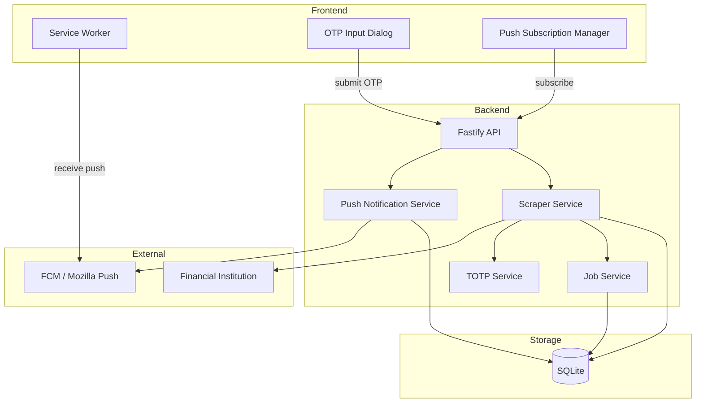
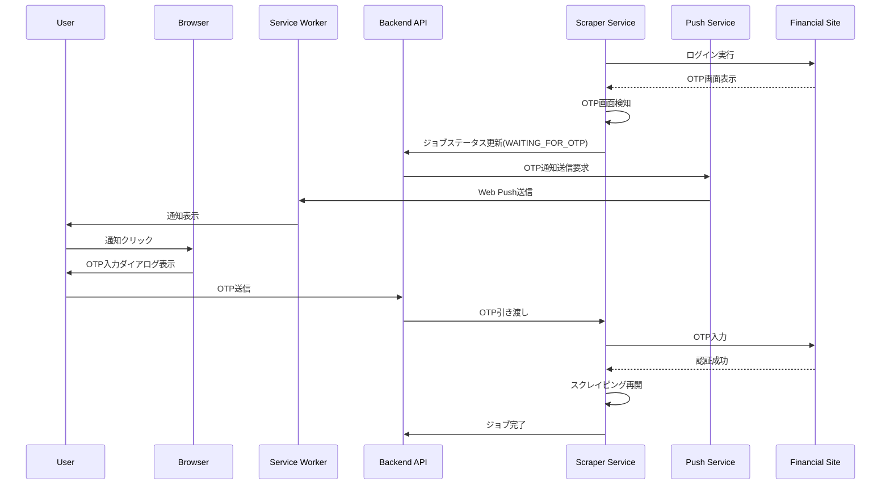
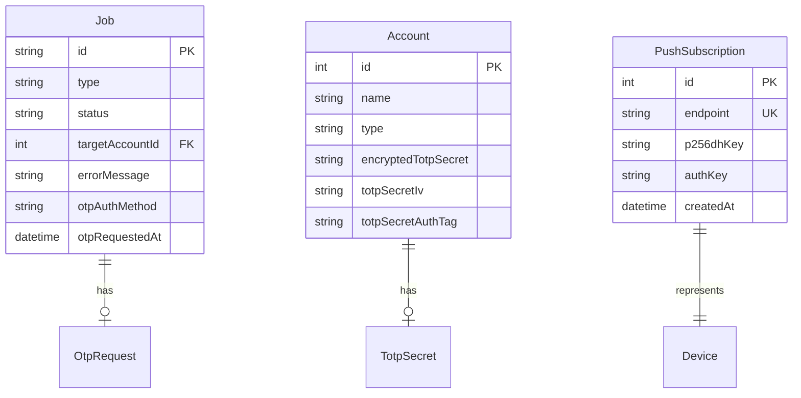

# Design Document: OTP/二要素認証対応機能

## Overview

**Purpose**: 金融機関スクレイピング時にOTP（ワンタイムパスワード）・二要素認証が求められた場合に、ユーザーへリアルタイム通知を行い、OTP入力を受け付けてスクレイピングを完了する機能を提供する。

**Users**: 本アプリケーションの利用者（開発者本人）が、OTP/2FAを要求する金融機関の取引データを自動取得するために使用する。

**Impact**: 既存のスクレイパーアーキテクチャを拡張し、OTP検知・待機・入力のフローを追加する。また、フロントエンドにWeb Push通知基盤とOTP入力UIを追加する。

### Goals

- OTP画面を自動検知し、ユーザーに即座にWeb Push通知を送信する
- ブラウザを閉じている状態でもPush通知を受信できる
- OTP入力後、5秒以内にスクレイピングを再開する
- TOTPシークレット事前登録により、手動入力なしで完全自動化を実現する

### Non-Goals

- SMS/メールOTPの自動取得（将来の拡張性として考慮）
- マルチユーザー対応（シングルユーザー想定を維持）
- 生体認証フロー対応
- モバイルアプリ開発

---

## Architecture

### Existing Architecture Analysis

**現在のスクレイパーアーキテクチャ**:
- `BaseScraper`抽象クラスが`scrape()`メソッドで同期的に完了まで実行
- `ScraperService`が認証情報取得→スクレイピング実行→結果処理を管理
- `JobService`が`pending | running | completed | failed`のステータスを管理
- `ScrapeErrorType`に`TWO_FACTOR_REQUIRED`は定義済みだが未使用

**既存PWA基盤**:
- `vite-plugin-pwa`でWorkbox自動生成モード（`registerType: 'autoUpdate'`）
- Service Workerはキャッシング用途のみ、Push通知未対応

**統合ポイント**:
- `BaseScraper`にOTP検知・待機・入力メソッドを追加
- `JobService`にOTP待機ステータスを追加
- PWA設定を`injectManifest`戦略に変更

### Architecture Pattern & Boundary Map

**Selected Pattern**: 既存のモジュール指向アーキテクチャを拡張



**Architecture Integration**:
- **Selected pattern**: モジュール指向（既存パターン維持）
- **Domain boundaries**: Push通知は独立モジュール、OTPロジックはスクレイパーモジュールに統合
- **Existing patterns preserved**: routes.ts / service.ts / schema.ts構成、Prisma ORM、TanStack Query
- **New components rationale**: Push Notification Serviceは外部サービス連携のため独立、TOTP Serviceはセキュリティ機密データを扱うため分離
- **Steering compliance**: TypeScript strict mode、Zod validation、AES-256-GCM暗号化

### Technology Stack

| Layer | Choice / Version | Role in Feature | Notes |
|-------|------------------|-----------------|-------|
| Frontend | vite-plugin-pwa 1.x (injectManifest) | カスタムService Worker基盤 | 設定変更必要 |
| Frontend | React 19 | OTP入力ダイアログUI | 既存 |
| Backend | web-push ^3.6.x | Web Push通知送信 | 新規追加 |
| Backend | otplib ^13.x | TOTP生成 | 新規追加 |
| Backend | Fastify 5 | API endpoints | 既存 |
| Data | Prisma (SQLite) | Push Subscription / Job状態永続化 | スキーマ拡張 |
| Infrastructure | Cloudflare Tunnel | HTTPS自動化 | 既存 |

---

## System Flows

### OTP検知から入力完了までのフロー



**Key Decisions**:
- スクレイパーはOTP待機中もブラウザセッションを維持（インメモリ保持）
- タイムアウト5分後に自動失敗処理
- TOTP事前登録済みの場合は通知なしで自動入力

---

## Requirements Traceability

| Requirement | Summary | Components | Interfaces | Flows |
|-------------|---------|------------|------------|-------|
| 1.1, 1.2, 1.3, 1.4 | OTP画面検知とジョブ一時停止 | BaseScraper, JobService | OtpDetectionResult | OTP検知フロー |
| 2.1, 2.2, 2.3, 2.4, 2.5, 2.6 | Web Push通知 | PushNotificationService, ServiceWorker | PushNotificationPayload | 通知送信フロー |
| 3.1, 3.2, 3.3, 3.4, 3.5 | サブスクリプション管理 | PushSubscriptionService, PushSubscriptionManager | PushSubscriptionAPI | サブスクリプション登録フロー |
| 4.1, 4.2, 4.3, 4.4, 4.5, 4.6 | OTP入力UI | OtpInputDialog | - | UI表示フロー |
| 5.1, 5.2, 5.3, 5.4, 5.5, 5.6, 5.7 | OTP送信とスクレイピング再開 | ScraperService, OtpSubmissionAPI | SubmitOtpRequest | OTP入力フロー |
| 6.1, 6.2, 6.3, 6.4, 6.5 | TOTPシークレット事前登録 | TotpService, AccountService | TotpSecretAPI | TOTP自動生成フロー |
| 7.1, 7.2, 7.3, 7.4 | タイムアウト処理 | ScraperService, PushNotificationService | - | タイムアウトフロー |
| 8.1, 8.2, 8.3, 8.4, 8.5 | エラーハンドリング | ScraperService, OtpInputDialog, Dashboard | OtpError | エラー処理フロー |
| 9.1, 9.2, 9.3, 9.4, 9.5 | セキュリティ要件 | 全コンポーネント | - | - |
| 10.1, 10.2, 10.3, 10.4 | 可用性・リカバリ | JobService, ScraperService | - | リカバリフロー |
| 11.1, 11.2, 11.3, 11.4, 11.5 | Service Worker実装 | CustomServiceWorker | ServiceWorkerAPI | Push受信フロー |

---

## Components and Interfaces

### Component Summary

| Component | Domain/Layer | Intent | Req Coverage | Key Dependencies | Contracts |
|-----------|--------------|--------|--------------|------------------|-----------|
| BaseScraper (拡張) | Backend/Scraper | OTP検知・待機・入力処理 | 1.1-1.4, 5.2-5.4 | Playwright (P0) | Service |
| PushNotificationService | Backend/Push | Web Push通知送信 | 2.1-2.6, 7.3 | web-push (P0) | Service, API |
| PushSubscriptionService | Backend/Push | サブスクリプション管理 | 3.2-3.5 | Prisma (P0) | Service, API |
| TotpService | Backend/Auth | TOTP生成 | 6.1-6.5 | otplib (P0), CryptoService (P0) | Service |
| JobService (拡張) | Backend/Jobs | OTPステータス管理 | 1.2, 10.1-10.3 | Prisma (P0) | Service |
| CustomServiceWorker | Frontend/SW | Push受信・通知表示 | 11.1-11.5, 2.4 | - | Event |
| OtpInputDialog | Frontend/UI | OTP入力ダイアログ | 4.1-4.6, 8.1, 8.3 | - | State |
| PushSubscriptionManager | Frontend/Hook | サブスクリプション登録 | 3.1 | - | State |

---

### Backend / Scraper Domain

#### BaseScraper (拡張)

| Field | Detail |
|-------|--------|
| Intent | OTP画面の検知、OTP入力待機、OTP入力処理を提供 |
| Requirements | 1.1, 1.2, 1.3, 1.4, 5.2, 5.3, 5.4 |

**Responsibilities & Constraints**
- OTP入力画面のセレクター判定
- OTP待機中のブラウザセッション維持（最大5分）
- OTP入力フィールドへの値設定と送信

**Dependencies**
- Inbound: ScraperService — scrape呼び出し (P0)
- External: Playwright — ブラウザ操作 (P0)

**Contracts**: Service [x]

##### Service Interface

```typescript
interface OtpDetectionResult {
  detected: boolean;
  authMethod: 'TOTP' | 'SMS' | 'EMAIL' | 'PUSH_APPROVAL' | null;
  otpInputSelector: string | null;
  otpSubmitSelector: string | null;
}

interface OtpWaitResult {
  success: boolean;
  otp: string | null;
  timedOut: boolean;
}

abstract class BaseScraper {
  // 既存メソッド
  abstract getSupportedAccountName(): string;
  abstract getLoginUrl(): string;
  abstract login(page: Page, credentials: DecryptedCredentials): Promise<void>;
  abstract fetchTransactions(page: Page): Promise<ScrapedTransaction[]>;
  abstract fetchBalance(page: Page): Promise<number>;

  // 新規追加メソッド
  protected async detectOtpScreen(page: Page): Promise<OtpDetectionResult>;
  protected async waitForOtp(timeoutMs: number): Promise<OtpWaitResult>;
  protected async submitOtp(page: Page, otp: string, selectors: { input: string; submit: string }): Promise<boolean>;

  // OTP対応のscrapeメソッド（オーバーライド）
  async scrapeWithOtp(
    credentials: DecryptedCredentials,
    onOtpRequired: (detection: OtpDetectionResult) => Promise<string | null>
  ): Promise<ScrapeResult>;
}
```

- Preconditions: ログインページにアクセス済み
- Postconditions: OTP入力完了またはタイムアウト
- Invariants: OTP待機中はブラウザセッションを維持

**Implementation Notes**
- Integration: 各金融機関スクレイパーはOTPセレクターを`getOtpSelectors()`で定義
- Validation: OTPは6桁または8桁の数字パターンを検証
- Risks: 金融機関のUI変更によるセレクター無効化

---

#### PushNotificationService

| Field | Detail |
|-------|--------|
| Intent | Web Push通知の送信とVAPID認証管理 |
| Requirements | 2.1, 2.2, 2.3, 2.4, 2.5, 2.6, 7.3 |

**Responsibilities & Constraints**
- VAPID鍵によるWeb Push送信
- 通知ペイロードの構築
- 送信失敗時のリトライ（1回）
- 送信は3秒以内に完了

**Dependencies**
- Inbound: ScraperService — 通知送信要求 (P0)
- Outbound: PushSubscriptionService — サブスクリプション取得 (P0)
- External: web-push — Push送信 (P0), FCM/Mozilla Push Service — 配信 (P0)

**Contracts**: Service [x] / API [x]

##### Service Interface

```typescript
interface PushNotificationPayload {
  type: 'OTP_REQUIRED' | 'OTP_TIMEOUT' | 'SCRAPING_FAILED';
  jobId: string;
  accountId: number;
  accountName: string;
  authMethod: 'TOTP' | 'SMS' | 'EMAIL' | 'PUSH_APPROVAL';
  message: string;
}

interface SendNotificationResult {
  success: boolean;
  statusCode: number;
  retried: boolean;
}

interface PushNotificationService {
  sendOtpRequiredNotification(
    jobId: string,
    accountId: number,
    accountName: string,
    authMethod: string
  ): Promise<SendNotificationResult>;

  sendTimeoutNotification(
    jobId: string,
    accountName: string
  ): Promise<SendNotificationResult>;
}
```

- Preconditions: 有効なPush Subscriptionが登録済み
- Postconditions: 通知がPushサービスに送信される
- Invariants: OTPはログに記録されない

##### API Contract

| Method | Endpoint | Request | Response | Errors |
|--------|----------|---------|----------|--------|
| GET | /api/push/vapid-public-key | - | `{ publicKey: string }` | 500 |

**Implementation Notes**
- Integration: 環境変数`VAPID_PUBLIC_KEY`, `VAPID_PRIVATE_KEY`, `VAPID_SUBJECT`を使用
- Validation: サブスクリプションが存在しない場合はログ警告のみ（通知スキップ）
- Risks: Pushサービスの一時的な障害

---

#### PushSubscriptionService

| Field | Detail |
|-------|--------|
| Intent | Push Subscriptionの永続化と管理 |
| Requirements | 3.2, 3.3, 3.4, 3.5 |

**Responsibilities & Constraints**
- サブスクリプション情報のCRUD操作
- エンドポイントURLによる重複チェック
- 無効サブスクリプションの検出と削除

**Dependencies**
- Inbound: API routes — CRUD操作 (P0)
- Outbound: Prisma — データ永続化 (P0)

**Contracts**: Service [x] / API [x]

##### Service Interface

```typescript
interface PushSubscriptionData {
  endpoint: string;
  keys: {
    p256dh: string;
    auth: string;
  };
}

interface PushSubscriptionService {
  subscribe(subscription: PushSubscriptionData): Promise<void>;
  unsubscribe(endpoint: string): Promise<void>;
  getSubscription(): Promise<PushSubscriptionData | null>;
  isSubscribed(): Promise<boolean>;
}
```

##### API Contract

| Method | Endpoint | Request | Response | Errors |
|--------|----------|---------|----------|--------|
| POST | /api/push/subscribe | `PushSubscriptionData` | `{ success: true }` | 400, 500 |
| DELETE | /api/push/unsubscribe | `{ endpoint: string }` | `{ success: true }` | 400, 404, 500 |
| GET | /api/push/status | - | `{ subscribed: boolean }` | 500 |

**Implementation Notes**
- Integration: フロントエンドの`PushManager.subscribe()`から呼び出し
- Validation: Zodでendpoint URL形式とkeys構造を検証
- Risks: ブラウザ側でサブスクリプションが失効した場合の検出

---

#### TotpService

| Field | Detail |
|-------|--------|
| Intent | TOTPシークレットの管理とOTP自動生成 |
| Requirements | 6.1, 6.2, 6.3, 6.4, 6.5 |

**Responsibilities & Constraints**
- TOTPシークレットの暗号化保存（AES-256-GCM）
- RFC 6238準拠のTOTP生成
- シークレット登録時のバリデーション

**Dependencies**
- Inbound: ScraperService — OTP生成要求 (P0), API routes — シークレット管理 (P0)
- Outbound: AccountService — アカウント情報取得 (P1), CryptoService — 暗号化 (P0)
- External: otplib — TOTP生成 (P0)

**Contracts**: Service [x] / API [x]

##### Service Interface

```typescript
interface TotpService {
  generateOtp(accountId: number): Promise<string | null>;
  saveSecret(accountId: number, secret: string): Promise<void>;
  deleteSecret(accountId: number): Promise<void>;
  hasSecret(accountId: number): Promise<boolean>;
}
```

- Preconditions: アカウントが存在する
- Postconditions: シークレットは暗号化されて保存される
- Invariants: 復号されたシークレットはメモリ上でのみ処理

##### API Contract

| Method | Endpoint | Request | Response | Errors |
|--------|----------|---------|----------|--------|
| POST | /api/accounts/:id/totp-secret | `{ secret: string }` | `{ success: true }` | 400, 404, 500 |
| DELETE | /api/accounts/:id/totp-secret | - | `{ success: true }` | 404, 500 |
| GET | /api/accounts/:id/totp-status | - | `{ hasSecret: boolean }` | 404, 500 |

**Implementation Notes**
- Integration: 既存のCryptoService（AES-256-GCM）を使用
- Validation: Base32形式のシークレット検証、16-32文字長
- Risks: シークレットの漏洩リスク（暗号化で軽減）

---

#### JobService (拡張)

| Field | Detail |
|-------|--------|
| Intent | OTP待機ステータスの追加とリカバリ処理 |
| Requirements | 1.2, 10.1, 10.2, 10.3 |

**Responsibilities & Constraints**
- `waiting_for_otp`ステータスの管理
- OTP要求時刻と認証方式の記録
- 未完了ジョブの検出とリカバリ

**Dependencies**
- Inbound: ScraperService — ステータス更新 (P0), API routes — ジョブ取得 (P0)
- Outbound: Prisma — データ永続化 (P0)

**Contracts**: Service [x]

##### Service Interface

```typescript
// 既存のJobStatusを拡張
type JobStatus = 'pending' | 'running' | 'completed' | 'failed' | 'waiting_for_otp';

interface OtpJobInfo {
  otpAuthMethod: 'TOTP' | 'SMS' | 'EMAIL' | 'PUSH_APPROVAL' | null;
  otpRequestedAt: Date | null;
}

interface JobService {
  // 既存メソッド
  create(type: JobType, targetAccountId?: number): Promise<Job>;
  getById(id: string): Promise<Result<Job, JobError>>;
  updateStatus(id: string, status: JobStatus, errorMessage?: string): Promise<Job>;

  // 新規追加メソッド
  setWaitingForOtp(
    id: string,
    authMethod: string
  ): Promise<Job>;

  getWaitingForOtpJobs(): Promise<Job[]>;

  recoverStaleOtpJobs(): Promise<void>;
}
```

**Implementation Notes**
- Integration: アプリ起動時に`recoverStaleOtpJobs()`を呼び出し
- Validation: OTP待機中のジョブは5分経過で自動失敗処理
- Risks: 同時に複数のOTP待機ジョブが発生した場合の優先度

---

#### OTP Submission API

| Field | Detail |
|-------|--------|
| Intent | フロントエンドからのOTP送信を受け付ける |
| Requirements | 5.1 |

**Contracts**: API [x]

##### API Contract

| Method | Endpoint | Request | Response | Errors |
|--------|----------|---------|----------|--------|
| POST | /api/scraping/:jobId/submit-otp | `{ otp: string }` | `{ success: boolean, message?: string }` | 400, 404, 409, 500 |
| POST | /api/scraping/:jobId/cancel-otp | - | `{ success: true }` | 404, 409, 500 |
| GET | /api/scraping/:jobId/otp-status | - | `{ status: JobStatus, authMethod?: string, remainingSeconds?: number }` | 404, 500 |

**Implementation Notes**
- Integration: OTP受信後、待機中のスクレイパーにEventEmitter経由で通知
- Validation: OTPは6-8桁の数字のみ受付
- Risks: 不正なジョブIDやステータス不整合

---

### Frontend / Service Worker

#### CustomServiceWorker

| Field | Detail |
|-------|--------|
| Intent | Push通知の受信、通知表示、クリックイベント処理 |
| Requirements | 11.1, 11.2, 11.3, 11.4, 11.5 |

**Responsibilities & Constraints**
- `push`イベントで通知を表示
- `notificationclick`でアプリをフォーカスまたはオープン
- クライアントへのメッセージ送信

**Dependencies**
- Inbound: FCM/Mozilla Push — Push受信 (P0)
- Outbound: Client — postMessage (P1)

**Contracts**: Event [x]

##### Event Contract

**Push Event Payload**:
```typescript
interface PushEventData {
  type: 'OTP_REQUIRED' | 'OTP_TIMEOUT' | 'SCRAPING_FAILED';
  jobId: string;
  accountId: number;
  accountName: string;
  authMethod: 'TOTP' | 'SMS' | 'EMAIL' | 'PUSH_APPROVAL';
  message: string;
}
```

**Client Message**:
```typescript
interface ServiceWorkerMessage {
  type: 'OPEN_OTP_DIALOG';
  jobId: string;
  accountId: number;
  accountName: string;
}
```

**Implementation Notes**
- Integration: `vite.config.ts`で`injectManifest`戦略に変更、`src/sw.ts`を作成
- Validation: 不明なpushタイプは無視
- Risks: Service Workerの更新タイミング

---

### Frontend / UI Components

#### OtpInputDialog

| Field | Detail |
|-------|--------|
| Intent | OTPコード入力用モーダルダイアログ |
| Requirements | 4.1, 4.2, 4.3, 4.4, 4.5, 4.6, 8.1, 8.3 |

**Responsibilities & Constraints**
- 数字のみ6-8桁の入力制限
- 対象アカウント名の表示
- 送信/キャンセルボタン
- エラーメッセージ表示

**Dependencies**
- Inbound: ServiceWorker message — ダイアログオープン (P0)
- Outbound: API — OTP送信 (P0)

**Contracts**: State [x]

##### State Management

```typescript
interface OtpDialogState {
  isOpen: boolean;
  jobId: string | null;
  accountId: number | null;
  accountName: string | null;
  otp: string;
  isSubmitting: boolean;
  error: string | null;
  remainingSeconds: number;
}

interface OtpDialogActions {
  open(jobId: string, accountId: number, accountName: string): void;
  close(): void;
  setOtp(otp: string): void;
  submit(): Promise<void>;
  cancel(): Promise<void>;
}
```

**Implementation Notes**
- Integration: TanStack Queryの`useMutation`でOTP送信
- Validation: 数字以外の入力は即座にフィルタリング
- Risks: 複数タブでの同時表示

---

#### PushSubscriptionManager (usePushNotification Hook)

| Field | Detail |
|-------|--------|
| Intent | Push通知の許可リクエストとサブスクリプション管理 |
| Requirements | 3.1 |

**Responsibilities & Constraints**
- ブラウザの通知許可状態の確認
- Push Subscriptionの登録/解除
- サブスクリプション状態の同期

**Contracts**: State [x]

##### State Management

```typescript
interface PushNotificationState {
  permission: NotificationPermission;
  isSubscribed: boolean;
  isLoading: boolean;
  error: string | null;
}

interface PushNotificationActions {
  requestPermission(): Promise<void>;
  subscribe(): Promise<void>;
  unsubscribe(): Promise<void>;
}

function usePushNotification(): PushNotificationState & PushNotificationActions;
```

**Implementation Notes**
- Integration: 設定画面または初回ログイン後に許可リクエスト
- Validation: HTTPS環境でのみ動作
- Risks: ブラウザが通知を永続的にブロックした場合

---

## Data Models

### Domain Model



### Physical Data Model

**Prisma Schema Extensions**:

```prisma
model Job {
  id              String   @id @default(cuid())
  type            String   // SCRAPE_ALL, SCRAPE_SPECIFIC
  status          String   @default("pending") // pending, running, completed, failed, waiting_for_otp
  targetAccountId Int?
  errorMessage    String?
  otpAuthMethod   String?  // TOTP, SMS, EMAIL, PUSH_APPROVAL
  otpRequestedAt  DateTime?
  createdAt       DateTime @default(now())
  updatedAt       DateTime @updatedAt

  @@index([status, createdAt])
}

model Account {
  id                     Int           @id @default(autoincrement())
  name                   String
  type                   String
  balance                Int           @default(0)
  encryptedCredentials   String?
  credentialsIv          String?
  credentialsAuthTag     String?
  encryptedTotpSecret    String?       // NEW
  totpSecretIv           String?       // NEW
  totpSecretAuthTag      String?       // NEW
  transactions           Transaction[]
  createdAt              DateTime      @default(now())
  updatedAt              DateTime      @updatedAt
}

model PushSubscription {
  id        Int      @id @default(autoincrement())
  endpoint  String   @unique
  p256dhKey String
  authKey   String
  createdAt DateTime @default(now())
  updatedAt DateTime @updatedAt
}
```

---

## Error Handling

### Error Categories and Responses

**User Errors (4xx)**:
- 400 Bad Request: OTP形式不正（数字以外、桁数違反）
- 404 Not Found: ジョブまたはアカウントが存在しない
- 409 Conflict: ジョブがOTP待機状態でない

**System Errors (5xx)**:
- 500 Internal Server Error: Push送信失敗、DB接続エラー
- 503 Service Unavailable: 外部Pushサービス障害

**Business Logic Errors (422)**:
- OTP入力3回失敗 → スクレイピング中止
- OTPタイムアウト → ジョブ失敗

### OTP Error Types

```typescript
type OtpErrorType =
  | 'INVALID_FORMAT'      // 数字以外または桁数違反
  | 'WRONG_OTP'           // 金融機関がOTPを拒否
  | 'MAX_RETRIES'         // 3回失敗
  | 'TIMEOUT'             // 5分経過
  | 'JOB_NOT_FOUND'       // ジョブが存在しない
  | 'JOB_NOT_WAITING'     // ジョブがOTP待機状態でない
  | 'PUSH_FAILED';        // Push通知送信失敗
```

### Monitoring

- OTP要求発生率のログ記録
- OTP入力成功/失敗率の追跡
- Push通知送信の成功/失敗率の監視
- タイムアウト発生頻度の監視

---

## Testing Strategy

### Unit Tests
- `TotpService.generateOtp()` - RFC 6238準拠のOTP生成
- `PushNotificationService.sendOtpRequiredNotification()` - ペイロード構築
- `JobService.setWaitingForOtp()` - ステータス遷移
- `BaseScraper.detectOtpScreen()` - セレクター判定ロジック

### Integration Tests
- Push Subscription登録→通知送信→受信の一連フロー
- OTP送信→スクレイパー再開の連携
- TOTP自動生成→OTP自動入力の連携

### E2E/UI Tests
- Push通知クリック→OTPダイアログ表示
- OTP入力→送信→結果表示
- 通知許可フロー

### Performance Tests
- Push通知送信が3秒以内に完了すること
- OTP入力後5秒以内にスクレイピング再開すること

---

## Security Considerations

### Threat Modeling

| Threat | Mitigation |
|--------|------------|
| OTPの盗聴 | HTTPS必須、Web Push暗号化 |
| TOTPシークレット漏洩 | AES-256-GCM暗号化、メモリ上でのみ復号 |
| Push Subscription偽装 | VAPID認証、エンドポイント検証 |
| OTP総当たり攻撃 | 3回失敗でロック、5分タイムアウト |

### Security Controls

- OTPはログに記録しない（`logger.info('OTP submitted for job ${jobId}')`のみ）
- TOTPシークレットは既存のCredentials暗号化と同等のセキュリティを適用
- HTTPS環境でのみService WorkerとWeb Push APIが動作

---

## Supporting References

### vite.config.ts変更例

```typescript
VitePWA({
  strategies: 'injectManifest',
  srcDir: 'src',
  filename: 'sw.ts',
  registerType: 'autoUpdate',
  injectManifest: {
    globPatterns: ['**/*.{js,css,html,svg,ico,png,woff,woff2}'],
  },
  devOptions: {
    enabled: true,
    type: 'module',
  },
})
```

### 環境変数追加

```bash
# .env
VAPID_PUBLIC_KEY=<generated-public-key>
VAPID_PRIVATE_KEY=<generated-private-key>
VAPID_SUBJECT=mailto:your-email@example.com
```
